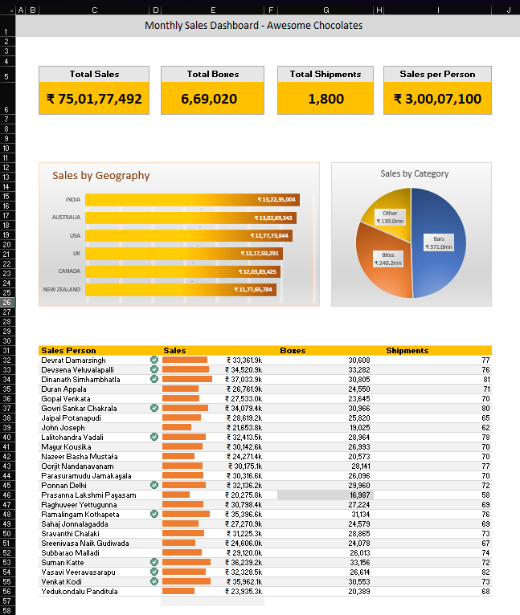

# Monthly Sales Dashboard using Microsoft Excel
Interactive Monthly Sales Dashboard built using Microsoft Excel.

## Project Overview

This project is an interactive Monthly Sales Dashboard created using Microsoft Excel to analyze sales performance and provide business insights.

## Dashboard Features

- Total Sales
- Total Profit
- Orders Analysis
- Monthly Sales Trend
- Category-wise Sales
- Region-wise Sales
- Interactive Slicers
- Dynamic Charts

## Tools Used

- Microsoft Excel
- Pivot Tables
- Pivot Charts
- Slicers
- Conditional Formatting

## Skills Demonstrated

- Data Cleaning
- Data Visualization
- Pivot Tables
- Pivot Charts
- Slicers
- KPI Dashboard Design
- Business Analysis

## Business Insights

- Identified top-performing categories.
- Compared monthly sales performance.
- Analyzed regional sales distribution.
- Monitored profit trends.
- Improved business decision-making through visualization.

## Files

- Monthly_Sales_Dashboard.xlsx
- dashboard.png

## Dashboard Preview

